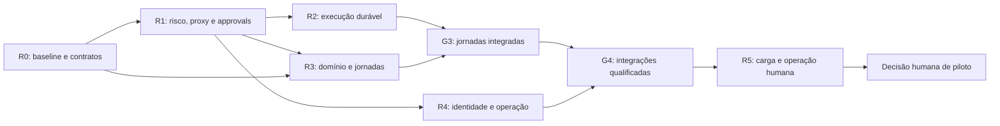

# 0312 — Roadmap de execução pós-auditoria

Data: 2026-09-05. Programa: `REM-0539`. Fonte: [auditoria 0539](../04_audit/0539_documentation_implementation_review.md). Estado: **EXECUÇÃO CONTROLADA — G1–G4 CONCLUÍDOS / G5 NO-GO CONTROLADO**. R1–R4 têm evidência local e crítica independente; R5 executou a qualificação conservadora e manteve produção/piloto real em NO-GO. [R3](../04_audit/0546_rem0539_r3_evidence.json), [R4](../04_audit/0547_rem0539_r4_evidence.json), [R5](../04_audit/0548_rem0539_r5_qualification_evidence.json).

## Estado dos gates após a execução

| Gate | Estado                                      | Evidência                                                                |
| ---- | ------------------------------------------- | ------------------------------------------------------------------------ |
| G0   | CONTROLADO                                  | `0542_rem0539_r0_evidence.json`                                          |
| G1   | COMPLETED_CONTROLLED                        | `0543_rem0539_r1_evidence.json`, `0544_rem0539_r1_closure_evidence.json` |
| G2   | COMPLETED_CONTROLLED                        | `0545_rem0539_r2_evidence.json`                                          |
| G3   | COMPLETED_CONTROLLED                        | `0546_rem0539_r3_evidence.json`                                          |
| G4   | COMPLETED_CONTROLLED, externo não conectado | `0547_rem0539_r4_evidence.json`                                          |
| G5   | NO-GO_CONTROLLED                            | `0548_rem0539_r5_qualification_evidence.json`                            |

## Como usar

Este roadmap detalha a sequência incremental proposta no [plano executivo](0311_plano_executivo_pos_auditoria.md). IDs REM referenciam o [backlog](0313_backlog_pos_auditoria.md). Durações são estimativas relativas após início autorizado e capacidade confirmada; esperas externas não estão incluídas. Nenhuma data de produção é assumida.

Toda onda de código segue DISCOVERY→PRD→SPEC→BUILD→AUDIT. O gate de entrada exige task registrada, contratos aprovados e revisão humana de BUILD conforme AGENTS; o gate de saída exige evidência específica. Aprovar este planejamento não aprova automaticamente SPEC ou BUILD. G0–G5 são marcos de acompanhamento deste programa, não substitutos dos gates CVG.

## Ondas e marcos

| Onda | Entrega                          | Duração      | Tasks     | Marco                                                                 |
| ---- | -------------------------------- | ------------ | --------- | --------------------------------------------------------------------- |
| R0   | Alinhar baseline e decisões      | 0,5–1 semana | REM-01–03 | G0: escopo e gates das correções registrados                          |
| R1   | Corrigir segurança e integridade | 2–3 semanas  | REM-04–08 | G1: F01/F05/F07 fechados por regressão e audit                        |
| R2   | Garantir processamento durável   | 2–3 semanas  | REM-09–12 | G2: aceitação, crash/retry e entrega controlada comprovados           |
| R3   | Completar jornadas em fixtures   | 3–4 semanas  | REM-13–18 | G3: cadastro, coleta, drafts, tarefas e handoff integrados            |
| R4   | Preparar integrações e operação  | 4–6 semanas  | REM-19–26 | G4: identidade, contratos externos, conteúdo e operação auditados     |
| R5   | Qualificar e decidir piloto      | 2–3 semanas  | REM-27–29 | G5: carga, operação humana e parecer; piloto só por decisão explícita |

Não somar prazo de atividades sobrepostas como esforço individual. A visão sequencial conservadora continua 14–20 semanas; o esforço de cada task usa tamanhos relativos no backlog, não dias contratados. A execução desta rodada percorreu R1–R5 em fixtures locais; o horizonte não inclui gates externos, decisão humana ou piloto real.

## Dependências principais

O desenho mostra dependências entre resultados. Detalhamento de R3 pode ocorrer após R1 e decisão RF-011; fechamento R3 depende também de R2. R4 pode iniciar contratos/identidade após R1, mas sua auditoria integrada depende de R3, durabilidade e de todas as entregas R4. Só considerar sobreposição quando houver responsáveis disponíveis, contratos estáveis e trabalho independente; ela não é autorização para executar agentes ou conectores em paralelo.

## R0 — Baseline e direção (REM-01–03)

Entrada: relatório 0539 e evidências 0541 disponíveis. Entrega: achados revalidados, discrepâncias classificadas e três contratos corretivos preparados/aprovados nos gates aplicáveis. A decisão RF-011 não deve bloquear uma correção de safety independente; deve preceder a evolução de workflows. G0 distingue decisão pendente de gate aprovado. Se a reprodução divergir do relatório, registrar nova evidência antes de propor código.

## R1 — Segurança e integridade (REM-04–08)

Entrada: REM-03 aprovado. Ordem: risco/preflight primeiro; proxy e approvals podem ser trabalhados independentemente após seus contratos. Saída: consulta+sangue encaminha sem tool; origem não confiável não afirma HTTPS; snapshots obsoletos não sobrescrevem decisão, com corrida forçada em PostgreSQL. Auditoria de fechamento obrigatória. Não abrir exposição externa com F01/F05/F07 ainda abertos.

## R2 — Durabilidade (REM-09–12)

Entrada: G1 fechado e SPEC R2 aprovada para BUILD controlado ([0012](../00_discovery/0012_rem0539_r2_durability.md), [0023](../01_prd/0023_rem0539_r2_durability.md), [0123](../02_spec/0123_rem0539_r2_contract.md)). Entrega: contrato de fila, consumidor/outbox, integração inbound assíncrona e matriz de falhas. Saída: aceite persistido, retomada após reinício, deduplicação, leases e falhas terminais investigáveis. O teste que antes comprovava apenas queue_adapter_missing precisa coexistir com uma prova positiva do adapter controlado. Nada de marcar processed sem entrega/ack durável.

## R3 — Secretária em fixtures (REM-13–18)

Entrada para desenvolvimento: G1 e decisão de arquitetura; para audit final: G2. Entrega: cadastro e drafts persistentes, coleta operacional, agenda sintética, tarefa vinculada e painel integrado. Saída: jornadas com dados fictícios e retomada após falha; nenhuma consulta real confirmada. UC-09 sem fonte mantém handoff seguro, com implementação de conteúdo tratada em R4. Reavaliar completude com os mesmos 39 RF, documentando mudanças formais de requisito separadamente.

## R4 — Integrações e operação (REM-19–26)

Entrada inicial: G1 e escopo decidido; integração final requer G3. Primeiro aprovar identidade, retenção, fontes, contratos, custo e egress. Depois implementar mocks locais de modelo/canal e ingestão sintética, gestão de secrets, observabilidade, artefato e recuperação. Gate externo é adicional: sandbox autorizado não equivale a canal/dado/fonte real autorizado. G4 registra o que foi efetivamente conectado; integração mock não recebe status externo concluído.

Se acessos não forem aprovados, concluir o que é localmente verificável e registrar entregas externas bloqueadas. Não promover o marco de qualificação real com base apenas nesses mocks.

## R5 — Qualificação e decisão (REM-27–29)

Entrada: G4 e ambiente de ensaio aprovado. Executar carga, falhas, disponibilidade, restore e roteiros de operação humana com dados sintéticos. Dossiê contém perfil de carga, latências, capacidade, RPO/RTO, riscos, responsáveis e proposta concreta de piloto. A decisão pode ser GO para um piloto expressamente limitado, NO-GO ou revisão de escopo. Nenhuma dessas decisões é produzida automaticamente pelo Test Lab, candidate VALIDATED ou nota de auditoria.

Execução e avaliação de piloto real não estão estimadas aqui: exigem backlog próprio após decisão de tenant/canal/volume/duração. Produção irrestrita permanece fora do programa.

## Regras de avanço e replanejamento

- Falha de segurança, isolamento, perda de mensagem ou decisão concorrente: interromper avanço do fluxo afetado e voltar à remediação; preservar evidência.
- Gate ausente: manter task bloqueada, concluir apenas trabalho documental/local independente já autorizado.
- No fim da onda: demonstrar o incremento, rodar gates apropriados e atualizar runtime/log/backlog/evidências. Não exigir as mesmas contagens históricas de testes; exigir a suíte vigente e explicar skips.
- Reestimar após R0/R1 e toda alteração relevante de escopo, capacidade ou dependência; não reduzir corpus ou critérios de aceite para caber no prazo.
- REM-30 (refatoração opcional) fica fora do caminho crítico e só entra com benefício concreto, capacidade disponível e gate próprio.

## Primeira janela de trabalho proposta

REM-01 → contratos de REM-03 → REM-04 → REM-05 → REM-08, com REM-06/07 entrando após os respectivos gates e concluindo antes de REM-08. REM-02 ocorre em R0 e precisa estar resolvida antes de REM-13. A janela desta execução terminou em G5 com `NO-GO` controlado, não em lançamento. O próximo ciclo depende de RF-011, responsáveis, metas RPO/RTO e gates externos; só então o detalhamento e o prazo de eventual piloto podem ser reestimados.
